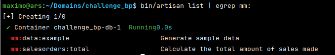
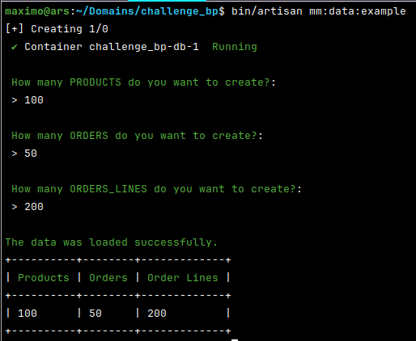
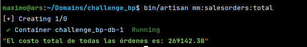
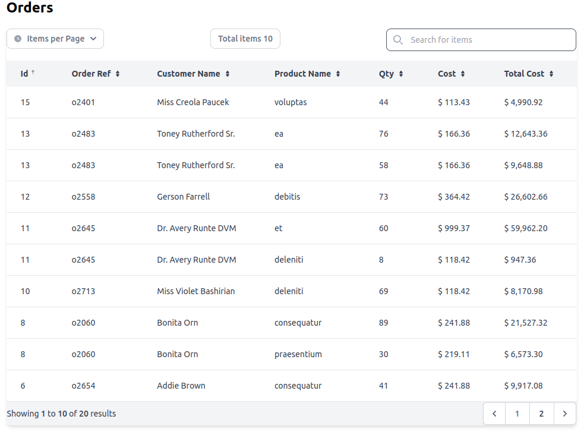

# Challenge BP

## Table of contents

- [Intro](#intro)
- [Setup environment](#setup-environment)
  - [Requirements](#requirements)
  - [Commands](#commands)
  - [Install](#Install)
    - [Clone repository](#clone-repository)
    - [Start project](#start-project)
    - [Check status](#check-status)
    - [Custom Domains](#custom-domains)
- [Validate Task](#validate-task)
  - [Create environment local](#1-create-environment-local)
  - [Sample Data](#2-sample-data)
  - [Through a jobs obtain salesorderstotal](#3-through-a-jobs-obtain-salesorderstotal)
  - [Show the data of the generated orders in the fe](#4-show-the-data-of-the-generated-orders-in-the-fe)

## Intro 

The objective of this project is **Create a project with Laravel 8 and Livewire** where the following elements should be used. See [Original requirements](docs/Requirements.md)

<table style="width:100%">
  <tr>
    <th>Scope</th>
    <th>Issues</th>
  </tr>
  <tr>
    <td>
        <ul>
            <li>Environment</li>
        </ul>
    </td>
    <td>Create environment local</td>
  </tr>
  <tr>
    <td>
        <ul>
            <li>Models</li>
            <li>Migrations</li>
            <li>Seeders</li>
            <li>Factories</li>
            <li>Commands</li>
        </ul>
    </td>
    <td>Sample Data</td>
  </tr>
    <td>
        <ul>
            <li>Commands</li>
            <li>Jobs</li>
        </ul>
    </td>
    <td>Through a Jobs obtain salesOrdersTotal</td>
  </tr>
  <tr>
    <td>
        <ul>
            <li>Livewire</li>
        </ul>
    </td>
    <td>Show the data of the generated orders in the fe</td>
  </tr>
</table>

## Setup environment 
### requirements
- GIT
- Docker 
- Docker-compose or docker compose 

(*) Validated in Linux based environments

### Commands

- `bin/docker` {up | start | stop | allstop | restart | logs | removeproject}
- `bin/composer` 
- `bin/artisan`

### Install

**[See full video](docs/img/setup_and_remove_environment.gif)**


#### Clone repository
```sh
mkdir -p ~/domains/challenge_bp
cd $_

git clone https://github.com/mmaximo33/challenge_bp ./
```

#### Start project
```sh
chmod +x bin/*

bin/docker up
```

#### Check status
Check the following urls
```sh
#App
http://localhost/

#Phpmyadmin
http://localhost:8080
```

#### Custom Domains
You can create a custom domain by replacing **mydomain.lcl** from the following command
```sh
grep -qxF '127.0.0.1 mydomain.lcl' /etc/hosts || echo "127.0.0.1 mydomain.lcl" | sudo tee -a /etc/hosts
```

## Validate Task
### 1 Create environment local
If I get to this point and you are viewing the Laravel screen, we have validated this requirement

You can see the available commands by running
```sh
bin/artisan list | egrep mm:
```


### 2 Sample Data
To validate this requirement we must do the following:

**Custom mode**

The following will happen

- Verify that the tables exist
  - Otherwise there will be a risk of `artisan migration`.
- It will ask you for the amount of random data to create for
  - Run the factories to 
    - Products
    - Orders
    - Order lines
- Create sample data
- It will return the result on the screen

```sh
# Load sample data
bin/artisan mm:data:example

# Clean 
bin/artisan migrate:rollback
```


**Simple mode**

The following will happen

- Migrations will be loaded
- The factories are loaded with the values established in the requirement

```sh
# Load sample data
bin/artisan migrate --seed

# Clean
bin/artisan migrate 
```

### 3 Through a Jobs obtain salesOrdersTotal
The next command available to continue performing the tasks.

- Dispatch a job which uses the Orders model to obtain the total sales made so far
- 
```sh
bin/artisan mm:salesorders:total
```



### 4 Show the data of the generated orders in the FE

The data generated in the previous tasks is displayed in the **root url** of the project

- General filter
- Items per page
- Pagination
- Sorted by fields




